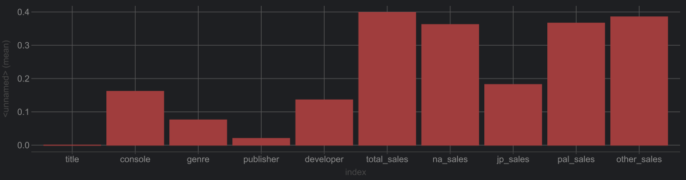

# Video Games Critic Score Prediction

Bu proje, video oyunlarının eleştirmen puanlarını tahmin etmek için bir Random Forest modeli kullanır. Proje, belirli özelliklere sahip oyun verilerini işler ve bu verileri kullanarak bir tahmin modeli oluşturur.

## İçindekiler
- [Kurulum](#kurulum)
- [Kullanım](#kullanım)
- [Proje Açıklaması](#proje-açıklaması)
- [Veri Seti](#veri-seti)
- [Korelasyon Grafiği](#korelasyon-grafiği)
- [Model Eğitimi ve Değerlendirme](#model-eğitimi-ve-değerlendirme)
- [Sonuçlar](#sonuçlar)
- [Katkıda Bulunma](#katkıda-bulunma)
- [Lisans](#lisans)

## Kurulum

Gerekli paketleri yüklemek için aşağıdaki adımları izleyin:

1. Gerekli Python paketlerini yükleyin:
    
'''bash
    pip install pandas scikit-learn
'''

2. Proje dosyasını klonlayın veya indirin.

## Kullanım

Proje dosyasını çalıştırmak için:

1. main.py dosyasını çalıştırın:
    
bash'''
    python main.py
'''

## Proje Açıklaması

Bu proje, video oyunlarının belirli özelliklerini kullanarak eleştirmen puanlarını tahmin eder. Model, RandomForestRegressor kullanarak oluşturulmuştur. Proje adımları aşağıdaki gibidir:

1. Verilerin okunması ve işlenmesi
2. Gerekli sütunların sayısal verilere dönüştürülmesi
3. Verilerin eğitim ve test setlerine ayrılması
4. Modelin eğitilmesi ve değerlendirilmesi
5. Tahminlerin orijinal veri setine eklenmesi
6. Sonuçların CSV dosyasına yazılması

## Veri Seti

Bu projede kullanılan veri seti Video_Games_Data.csv dosyasıdır ve çeşitli video oyunları hakkında bilgiler içermektedir. Özellikler şunlardır:

- title: Oyunun adı
- console: Oyunun piyasaya sürüldüğü oyun konsolu
- genre: Oyunun türü
- publisher: Oyunun yayıncısı
- developer: Oyunun geliştiricisi
- total_sales: Toplam satışlar
- na_sales: Kuzey Amerika satışları
- jp_sales: Japonya satışları
- pal_sales: PAL bölgesi satışları
- other_sales: Diğer bölgelerdeki satışlar

## Korelasyon Grafiği
Aşağıdaki grafikte, hangi özelliklerin eleştirmen puanını tahmin etmede daha etkili olduğunu görebilirsiniz. Özellikle total_sales, na_sales, pal_sales ve other_sales gibi satış rakamlarının eleştirmen puanını tahmin etmede önemli bir etkiye sahip olduğunu görmekteyiz.

## Model Eğitimi ve Değerlendirme

Model, RandomForestRegressor kullanarak eğitilir ve test seti üzerinde değerlendirilir. Modelin doğruluğu mean_squared_error ile ölçülür.

## Sonuçlar

Modelin tahminleri orijinal veri setine eklenir ve sonuçlar Sonuc.csv dosyasına yazılır. Bu dosyada, her bir oyun için modelin tahmin ettiği eleştirmen puanları bulunur.

## İletişim

Proje ile ilgili sorularınız için [uzayk204@gmail.com](mailto:uzayk204@gmail.com) adresinden iletişime geçebilirsiniz.

## Katkıda Bulunma

Katkılarınızı memnuniyetle kabul ediyoruz! Lütfen katkıda bulunmadan önce [CONTRIBUTING.md](CONTRIBUTING.md) dosyasını okuyun.

## Lisans

Bu proje [MIT Lisansı](LICENSE) ile lisanslanmıştır.

